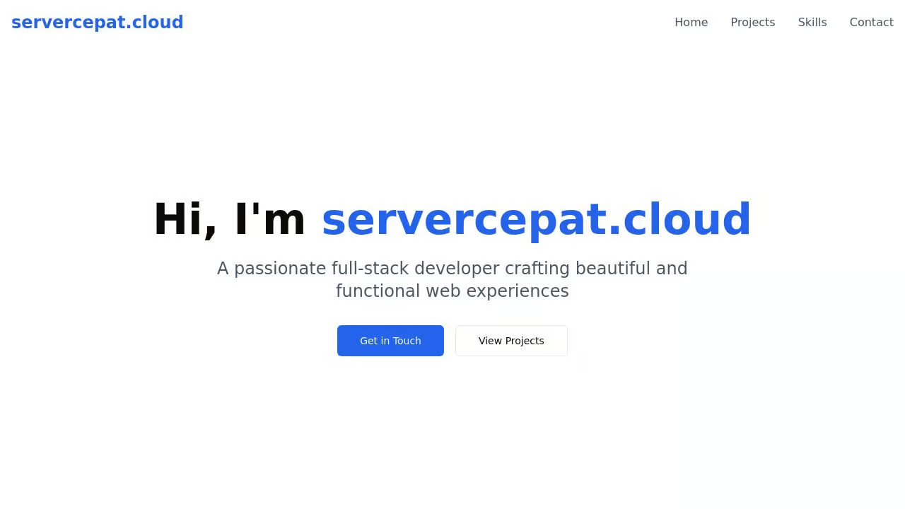

# Personal Portfolio Website

A modern, responsive personal portfolio website built with React and Tailwind CSS. This portfolio showcases projects, skills, and provides a way for potential clients or employers to get in touch.



## Features

- 📱 Fully responsive design
- 🎨 Modern UI with smooth animations
- 🎯 Interactive project showcase
- 💪 Skills and expertise section
- 📬 Contact form
- 🌙 Professional styling with Tailwind CSS
- ⚡ Fast performance with Vite

## Technologies Used

- **Frontend:**
  - React
  - TypeScript
  - Tailwind CSS
  - Framer Motion (animations)
  - shadcn/ui (UI components)
  - React Icons

- **Build Tools:**
  - Vite
  - PostCSS
  - TypeScript

## Getting Started

1. Clone the repository:
```bash
git clone <repository-url>
```

2. Install dependencies:
```bash
npm install
```

3. Start the development server:
```bash
npm run dev
```

4. Open [http://localhost:5000](http://localhost:5000) in your browser

## Project Structure

```
├── client/
│   ├── src/
│   │   ├── components/
│   │   │   └── ui/         # UI components
│   │   ├── pages/          # Page components
│   │   ├── lib/            # Utilities and helpers
│   │   └── App.tsx         # Main application component
├── server/                 # Express server setup
├── shared/                 # Shared types and schemas
└── public/                # Static assets
```

## Deployment

The project is configured for deployment on Replit. The production build can be created using:

```bash
npm run build
```

## Contact

For any inquiries or collaboration opportunities, please reach out through the contact form on the website.

## License

This project is licensed under the MIT License - see the LICENSE file for details.
habizinnia@gmail.com